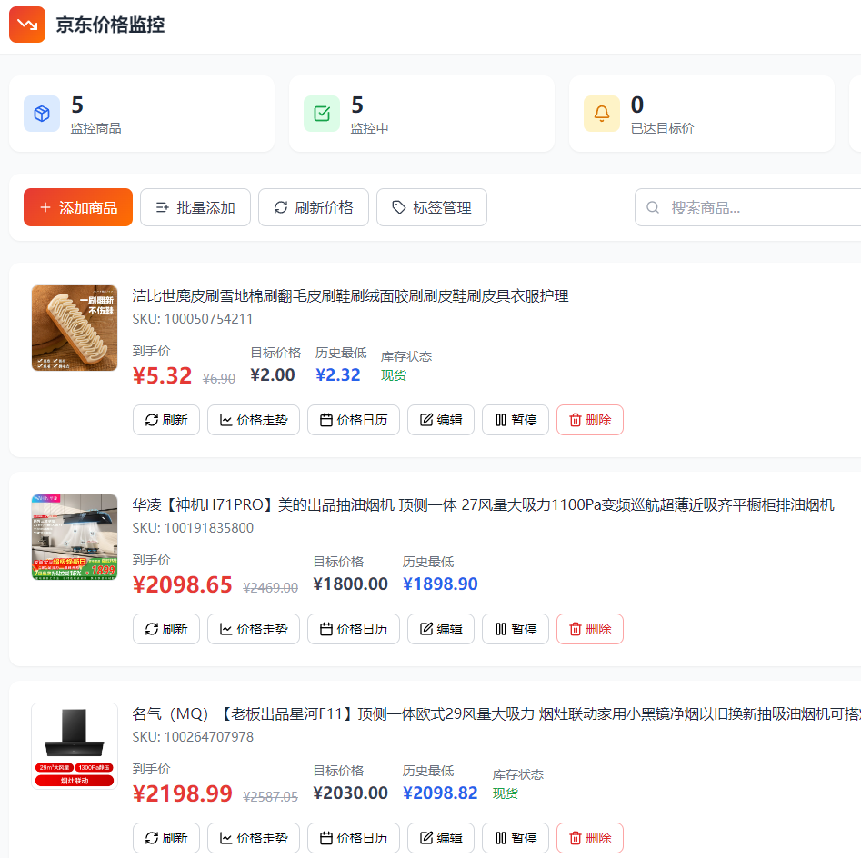

# 京东商品价格监控系统

一个基于 PHP + SQLite 的京东商品价格监控系统，支持价格监控、降价通知、价格走势图表等功能。

## 功能演示

### 商品管理界面



## 功能特性

### 商品管理
- 添加/编辑/删除商品
- 支持PC链接、APP分享链接、短链接解析
- 商品图片自动获取
- 当前价格与原价同时显示
- 标签分类管理

### 价格监控
- 实时价格检查
- 价格走势图表（7天/周/月/季/年/全部）
- 价格涨跌颜色区分（绿色降价/红色涨价）
- 图表支持拖动平移和缩放
- 历史最低价标记

### 通知系统
- 降价提醒、价格上涨提醒
- 历史最低价提醒
- 商品无货/有货提醒
- Cookie失效提醒
- 支持钉钉、企业微信、Telegram、Discord、Slack等

### 安全特性
- CSRF防护
- 登录限流（5次失败锁定15分钟）
- 安全响应头（CSP、X-Frame-Options等）
- HttpOnly Cookie

## 环境要求

- PHP 7.4+
- SQLite3 扩展
- cURL 扩展

## 安装使用

```bash
# 内置sqlite数据库
直接上传使用
```

### 使用步骤

1. 首次登录默认密码：`admin123`，登录后请修改密码
2. 设置 → 京东配置 → 获取Cookie
3. 设置 → 通知配置 → 添加Webhook
4. 添加商品链接，设置目标价格

### 定时任务配置

**Linux/Mac (Crontab):**
```bash
# 编辑crontab
crontab -e

# 每5分钟检查一次价格
*/5 * * * * curl -s http://your-domain/api/check-price.php?cron=1 > /dev/null

# 或使用本地PHP执行
# 每5分钟执行一次价格更新
*/5 * * * * php /path/to/jd/cron.php update_prices

# 每小时检查一次Cookie状态
0 * * * * php /path/to/jd/cron.php check_cookie

# 或者每5分钟执行所有任务
*/5 * * * * php /path/to/jd/cron.php all
```

**Windows (任务计划程序):**
1. 打开"任务计划程序"
2. 创建基本任务 → 名称：京东价格监控
3. 触发器：每天，重复间隔5分钟
4. 操作：启动程序
   - 程序：`php`
   - 参数：`cron.php`
   - 起始位置：`D:\code\jd`

---

## 价格获取机制

### 获取方法（按顺序尝试）

| 排名 | 方法 | 来源 | 获取内容 | 超时 |
|------|------|------|----------|------|
| 1 | 移动端页面 | item.m.jd.com | 名称、到手价、原价、库存 | 5秒 |
| 2 | 移动端API | api.m.jd.com | 名称、到手价、库存 | 5秒 |
| 3 | 公开API | p.3.cn | 到手价 | 5秒 |
| 4 | PC端页面 | item.jd.com | 图片、原价 | 5秒 |

### 获取逻辑

```
1. 按顺序尝试移动端页面 → 移动端API → 公开API
2. 成功获取到手价后，继续尝试获取原价
3. 最后从PC端补充图片和原价
4. 如果原价 < 到手价，使用到手价作为原价
```

### 成功率统计

系统自动记录每种方法的成功率和平均耗时，在设置页面显示动态排名：

- **成功率**：成功次数 / 总调用次数
- **平均耗时**：所有调用的平均响应时间
- **排名规则**：成功率优先，耗时次之

---

## 价格走势图表

### 时间范围
7天 | 周(7天) | 月(30天) | 季(90天) | 年(365天) | 全部

### 图表操作
- **拖动平移**：按住鼠标左键/手指拖动
- **缩放**：滚轮/双指缩放
- **重置**：点击重置按钮

### 价格颜色
- 🟢 绿色：价格下降
- 🔴 红色：价格上涨

---

## 通知类型

| 类型 | 说明 |
|------|------|
| price_drop | 降价提醒 |
| price_update | 价格更新通知 |
| lowest_price | 历史最低价 |
| price_surge | 价格上涨 |
| out_of_stock | 商品无货 |
| back_in_stock | 商品有货 |
| cookie_invalid | Cookie失效 |

---

## 文件说明

```
├── index.php              # 主页面（前端界面）
├── cron.php               # 定时任务脚本
│
├── api/
│   ├── auth.php           # 认证API（登录/登出/密码修改）
│   ├── products.php       # 商品管理API（增删改查）
│   ├── check-price.php    # 价格检查API
│   ├── settings.php       # 系统设置API
│   ├── notify.php         # 通知测试API
│   ├── export.php         # 数据导出API
│   └── network_check.php  # 网络检测API
│
├── includes/
│   ├── config.php         # 配置文件（常量定义、CSRF、安全头）
│   ├── db.php             # 数据库类（SQLite操作）
│   ├── auth.php           # 认证类（登录验证、限流）
│   ├── jd.php             # 京东价格获取类
│   └── webhook.php        # Webhook通知类
│
└── data/
    └── monitor.db         # SQLite数据库（自动创建）
```

---

## 数据库表结构

### products - 商品表
| 字段 | 类型 | 说明 |
|------|------|------|
| id | INTEGER | 主键 |
| sku_id | TEXT | 京东SKU |
| name | TEXT | 商品名称 |
| image_url | TEXT | 图片URL |
| current_price | REAL | 当前价格 |
| original_price | REAL | 原价 |
| target_price | REAL | 目标价格 |
| lowest_price | REAL | 历史最低价 |
| highest_price | REAL | 历史最高价 |
| stock_status | TEXT | 库存状态 |
| status | TEXT | 状态(active/paused) |
| tags | TEXT | 标签 |

### price_history - 价格历史表
| 字段 | 类型 | 说明 |
|------|------|------|
| id | INTEGER | 主键 |
| product_id | INTEGER | 商品ID |
| price | REAL | 价格 |
| stock_status | TEXT | 库存状态 |
| recorded_at | DATETIME | 记录时间 |

### price_method_stats - 价格获取方法统计表
| 字段 | 类型 | 说明 |
|------|------|------|
| id | INTEGER | 主键 |
| method | TEXT | 方法名称 |
| success_count | INTEGER | 成功次数 |
| total_count | INTEGER | 总调用次数 |
| total_time | REAL | 总耗时(秒) |
| last_success_at | DATETIME | 最后成功时间 |

### settings - 系统设置表
| 字段 | 类型 | 说明 |
|------|------|------|
| id | INTEGER | 主键 |
| access_password | TEXT | 访问密码 |
| jd_cookies | TEXT | 京东Cookie |
| cookie_status | TEXT | Cookie状态 |
| webhooks | TEXT | Webhook配置(JSON) |

### login_attempts - 登录尝试表
| 字段 | 类型 | 说明 |
|------|------|------|
| id | INTEGER | 主键 |
| ip_address | TEXT | IP地址 |
| attempts | INTEGER | 失败次数 |
| lockout_until | DATETIME | 锁定到期时间 |

---

## 常见问题

**Q: Cookie多久过期？**
A: 1-3个月，系统会发送失效通知。

**Q: 为什么获取不到价格？**
A: 
1. Cookie未设置或已失效
2. 商品已下架
3. 被京东风控拦截（尝试更换Cookie）

**Q: 价格获取很慢怎么办？**
A: 
1. 查看设置页面的"价格获取方法统计"
2. 成功率低的方法会被自动降权
3. 网络问题可尝试使用代理

**Q: 图表空白怎么办？**
A: 点击重置按钮，检查浏览器控制台错误。

**Q: 短链接无法解析？**
A: 
1. 确保服务器能访问外网
2. 检查cURL扩展是否安装
3. 尝试直接使用完整商品链接

---

## 更新日志

详见 [CHANGES.md](CHANGES.md)

---

## 开源协议

MIT License
